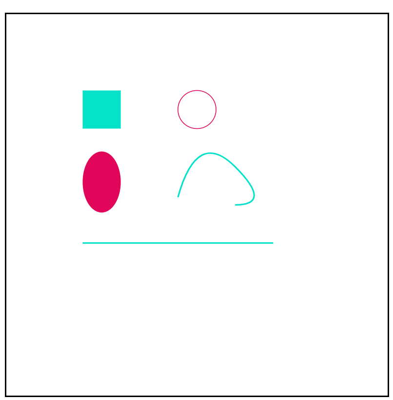

# svg-wrapper
A very basic wrapper around the ```<svg>``` element.
## Why ?
The ```<svg>``` element is pretty powerful , but dealing with it using VanillaJS is a real hustle.Here is what creating a circle looks like :
```javascript
 // get the parent node
const wrapper = document.getElementById('wrapper');
// create the svg element
const svg = document.createElementNS('http://www.w3.org/2000/svg', 'svg');
//set width and height
svg.setAttributeNS(null, 'width', '500');
svg.setAttributeNS(null, 'height', '500');
// append svg to parent
wrapper.appendChild(svg);
//create circle element
const circle = document.createElementNS('http://www.w3.org/2000/svg', 'circle');
// set x,y positions and the radius
circle.setAttributeNS(null, 'cx', 50);
circle.setAttributeNS(null, 'cy', 50);
circle.setAttributeNS(null, 'r', 10);
//append the circle to the svg
svg.appendChild(circle);
```

Using svg-wrapper here what it looks like (doing the same thing) :
```javascript
const svg = new SVG('#wrapper',500,500); // create svg element
svg.circle(50,50,10);// add a circle to the svg element
```

## Getting Started
If you have never used the ```<svg>``` element, the element reference on MDN web docs will of great help: https://developer.mozilla.org/en-US/docs/Web/SVG/Element/svg
### creating svg element

Creating an svg element and adding it the dom is as simple as instanciating the 
```SVG(parentID | parentClass,width,height)``` class:
```javascript
// In case you want to select the parent element using class just use .class_name instead.
const svg = new SVG('#wrapper',500,500); 
```
### creating a shape
Now all you need to do is call a method:
```javascript
const svg = new SVG('#wrapper',500,500);
// creating rectangle element
const rect = svg.rect({x:100,y:100,width:50,height:50});
// creating circle element
const circle = svg.circle({cx:250,cy:125,r:25});
// creating ellipse element
const ellipse = svg.ellipse({cx:125,cy:220,rx:25,ry:40});
// creating line element
const line  = svg.line({x1:100,y1:300,x2:350,y2:300});
// creating path element
const path = svg.path('M225,240 Q250,150 300,200 T300 250');

```


### Styling an svg or shape :
For now the only way for adding style is via a css class:

Let's assume we have the following css :
```css
.svg{
    background: white;
    border: 2px solid black;
}
.rect{fill:#06e2c9;}
.circle{
    stroke:#e2065b;
    fill: white;
}
.ellipse{fill:#e2065b;}
.path , .line{
    fill:none; 
    stroke:#06e2c9;
    stroke-width:2px;
}
```
 In the javascript just call the ```addClass(className)``` method :
```javascript
// add classes to the svg element and the shapes
svg.addClass('svg');
rect.addClass('rect');
circle.addClass('circle');
ellipse.addClass('ellipse');
line.addClass('line');
path.addClass('path');
```

This the result of addding those classes : 


### Moving a shape
Now let's say you created a shape and want to move it:
```javascript
// just supply the desired coordinates
rect.move(20,20); 
circle.move(100,150);
ellipse.move(200,50);

line.move(100,200,100,300); // here you need to supply the coordinates of two points
```

### Installation
For now just copy the src/ folder 


### Todos

 - Add animation 
 - Clean the code
 - Bundle the js

## License

Apache 2.0. See [/LICENSE](/LICENSE)

